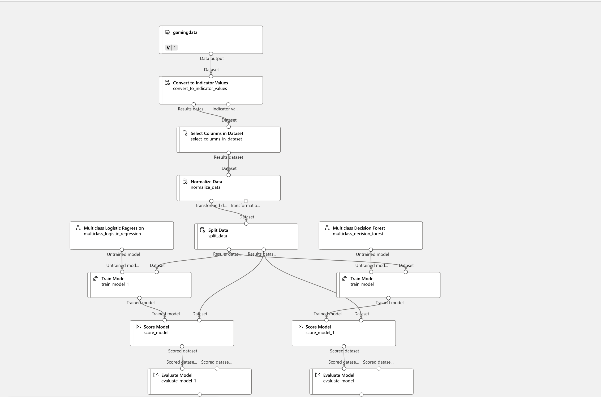

# Classifying Gamer Engagement Levels 🎮

**Overview:**  
This problem dives into analyzing gamer engagement using cool ML algorithms. We are using KNN and Random Forest to classify gamers into Low, Medium, and High engagement tiers. Then, we explore data preprocessing and multiclass classification using Azure ML Designer.

**What's Inside:**  
- **Data & EDA:** Load the gamer dataset, clean it up, encode features, and perform exploratory analysis.  
- **Models:** Train and evaluate Random Forest & KNN classifiers with metrics, confusion matrices, and ROC curves.  
- **Azure ML Designer:** Build a pipeline for multiclass classification using Logistic Regression and Decision Forest, then compare their performance.

**Why It Rocks:**  
This problem not only sharpens your ML skills but also shows off your ability to blend traditional coding with cloud-based ML tools—perfect for boosting player retention strategies! 🚀

---
